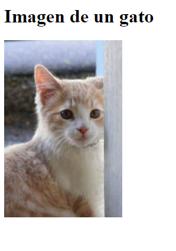
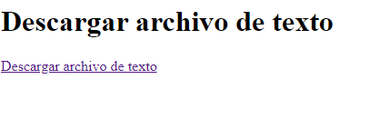
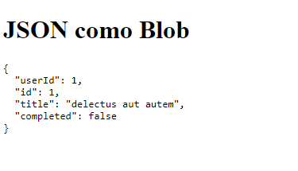
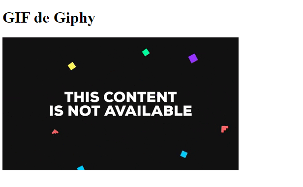
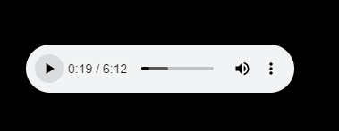
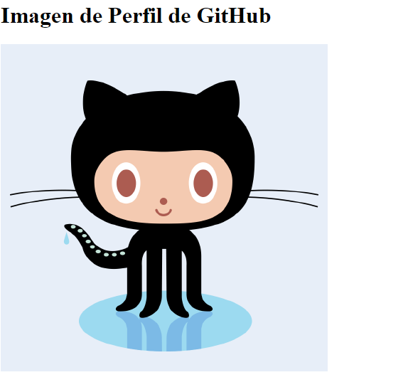
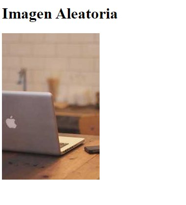

# Ejercicios con get Blob

## Ejercicio 1: Obtener y mostrar una imagen

### Solución
```html
<!DOCTYPE html>
<html lang="es">
<head>
    <meta charset="UTF-8">
    <title>Mostrar Imagen</title>
</head>
<body>
    <h1>Imagen de un gato</h1>
    
    <script>
        fetch('https://placekitten.com/200/300') // URL de la imagen
            .then(response => response.blob())
            .then(blob => {
                const imgElement = document.getElementById('image');
                imgElement.src = URL.createObjectURL(blob);
            })
            .catch(error => console.error('Error:', error));
    </script>
</body>
</html>
```
### Explicación

Este código utiliza fetch para obtener una imagen de un gato. Convierte la respuesta en un objeto Blob y luego crea una URL temporal para mostrar la imagen en un elemento ``````.


### Resultado


## Ejercicio 2: Descargar un archivo de texto

### Solución
```html
<!DOCTYPE html>
<html lang="es">
<head>
    <meta charset="UTF-8">
    <title>Descargar Archivo de Texto</title>
</head>
<body>
    <h1>Descargar archivo de texto</h1>
    <a id="downloadLink" href="#">Descargar archivo de texto</a>
    <script>
        fetch('https://www.w3.org/TR/PNG/iso_8859-1.txt') // URL del archivo de texto
            .then(response => response.blob())
            .then(blob => {
                const url = URL.createObjectURL(blob);
                const downloadLink = document.getElementById('downloadLink');
                downloadLink.href = url;
                downloadLink.download = 'archivo.txt'; // Nombre del archivo a descargar
            })
            .catch(error => console.error('Error:', error));
    </script>
</body>
</html>
```
### Explicación
Este código descarga un archivo de texto desde una URL. Crea un enlace de descarga que permite a los usuarios descargar el archivo en su computadora.

### Resultado


## Ejercicio 3: Obtener un archivo JSON como Blob
### Solución
```html
Copiar código
<!DOCTYPE html>
<html lang="es">
<head>
    <meta charset="UTF-8">
    <title>Obtener JSON como Blob</title>
</head>
<body>
    <h1>JSON como Blob</h1>
    <pre id="jsonOutput"></pre>
    <script>
        fetch('https://jsonplaceholder.typicode.com/todos/1') // URL del JSON
            .then(response => response.blob())
            .then(blob => {
                const reader = new FileReader();
                reader.onload = function () {
                    const jsonOutput = document.getElementById('jsonOutput');
                    jsonOutput.textContent = reader.result;
                };
                reader.readAsText(blob);
            })
            .catch(error => console.error('Error:', error));
    </script>
</body>
</html>
```
### Explicación
Este código obtiene un archivo JSON y lo convierte en un objeto Blob. Luego, utiliza un FileReader para leer el contenido del Blob y mostrarlo en la página.

### Resultado



## Ejercicio 4: Mostrar un GIF
### Solución
```html
<!DOCTYPE html>
<html lang="es">
<head>
    <meta charset="UTF-8">
    <title>Mostrar GIF</title>
</head>
<body>
    <h1>GIF de Giphy</h1>
    
    <script>
        fetch('https://media.giphy.com/media/JIX8t1j0ZTN9S/giphy.gif') // URL del GIF
            .then(response => response.blob())
            .then(blob => {
                const imgElement = document.getElementById('gif');
                imgElement.src = URL.createObjectURL(blob);
            })
            .catch(error => console.error('Error:', error));
    </script>
</body>
</html>
```
### Explicación
Este código obtiene un GIF y lo muestra en la página utilizando un objeto Blob.

### Resultado



## Ejercicio 5: Obtener un archivo de audio

### Solución

```javascript
    
        fetch('https://www.soundhelix.com/examples/mp3/SoundHelix-Song-1.mp3') // URL del audio
            .then(response => response.blob())
            .then(blob => {
                const audioPlayer = document.getElementById();
                audioPlayer.src = URL.createObjectURL(blob);
            })
            .catch(error => console.error('Error:', error));
    
```
## Explicación
Este código obtiene un archivo de audio y lo reproduce en un elemento  en la página, utilizando un objeto Blob.

### Resultado


## Ejercicio 6: Mostrar un texto desde un archivo
### Solución
```html
Copiar código
<!DOCTYPE html>
<html lang="es">
<head>
    <meta charset="UTF-8">
    <title>Mostrar Texto desde Archivo</title>
</head>
<body>
    <h1>Texto desde Archivo</h1>
    <p id="textOutput"></p>
    <script>
        fetch('https://www.w3.org/TR/PNG/iso_8859-1.txt') // URL del archivo de texto
            .then(response => response.blob())
            .then(blob => {
                const reader = new FileReader();
                reader.onload = function () {
                    const textOutput = document.getElementById('textOutput');
                    textOutput.textContent = reader.result;
                };
                reader.readAsText(blob);
            })
            .catch(error => console.error('Error:', error));
    </script>
</body>
</html>
```
### Explicación
Este código obtiene un archivo de texto, lo convierte en un Blob y lo lee con un FileReader para mostrar su contenido en la página.
### Resultado



## Ejercicio 7: Mostrar una imagen de un perfil
### Solución
```html
Copiar código
<!DOCTYPE html>
<html lang="es">
<head>
    <meta charset="UTF-8">
    <title>Mostrar Imagen de Perfil</title>
</head>
<body>
    <h1>Imagen de Perfil de GitHub</h1>
    
    <script>
        fetch('https://api.github.com/users/octocat') // URL de la API de GitHub
            .then(response => response.json())
            .then(data => {
                const imgElement = document.getElementById('profileImage');
                imgElement.src = data.avatar_url; // URL de la imagen de perfil
            })
            .catch(error => console.error('Error:', error));
    </script>
</body>
</html>
```
### Explicación
Este código realiza una solicitud a la API de GitHub para obtener datos de un usuario y muestra su imagen de perfil en la página.

### Resultado



## Ejercicio 8: Obtener una imagen aleatoria
Solución
```html
<!DOCTYPE html>
<html lang="es">
<head>
    <meta charset="UTF-8">
    <title>Obtener Imagen Aleatoria</title>
</head>
<body>
    <h1>Imagen Aleatoria</h1>
    
    <script>
        fetch('https://picsum.photos/200/300') // URL de imagen aleatoria
            .then(response => response.blob())
            .then(blob => {
                const imgElement = document.getElementById('randomImage');
                imgElement.src = URL.createObjectURL(blob);
            })
            .catch(error => console.error('Error:', error));
    </script>
</body>
</html>
```
### Explicación
Este código obtiene una imagen aleatoria de Picsum y la muestra en la página.

Resultado

