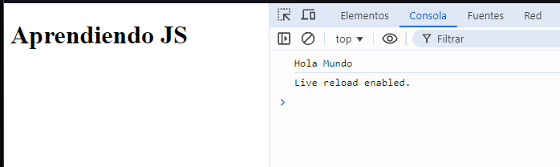
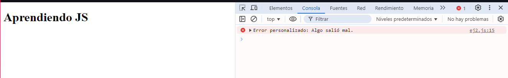
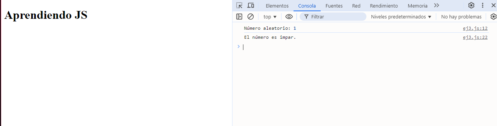
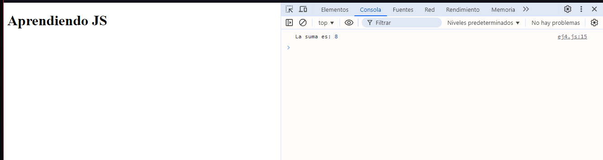
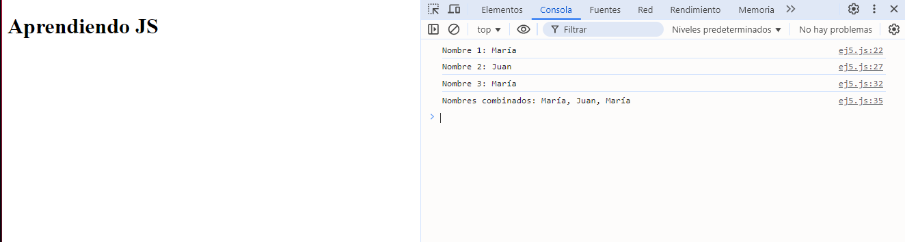
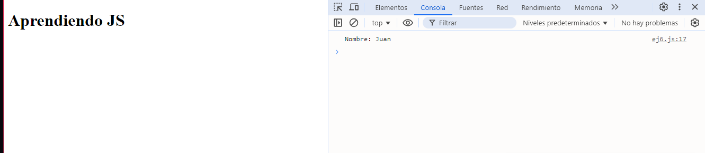
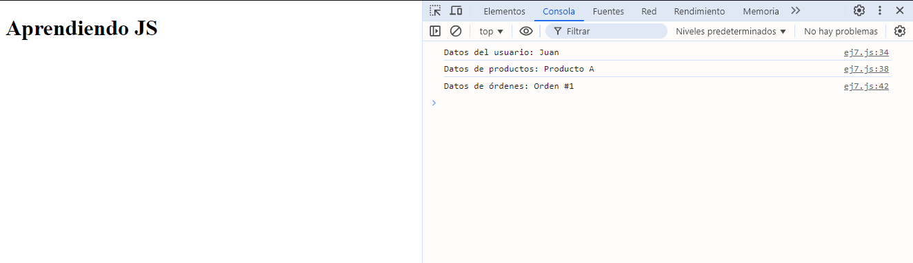
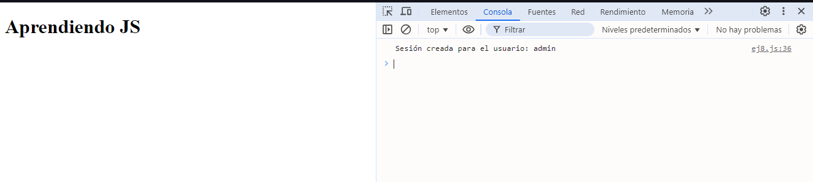

# Ejercicios promesas en cadena

## 1. Cadena de Dos Promesas

Crea una promesa que se resuelva con el valor "Hola". Encadena otra promesa que tome este valor y lo concatene con " Mundo". Imprime el resultado final.

### Solución

```javascript
const promesaHola = new Promise((resolve) => {
    resolve("Hola");
});

// Encadenar otra promesa que concatene "Hola" con " Mundo"
promesaHola
    .then((valor) => {
        return valor + " Mundo"; // Concatenar el valor
    })
    .then((resultadoFinal) => {
        console.log(resultadoFinal); // Imprimir el resultado final
    });
```
### Explicación

- **`resolve("Hola")`**: La función `resolve` se llama con el valor "Hola", lo que significa que la promesa se resolverá exitosamente con este valor. Esto simula una operación que se completa de manera exitosa.

- Se encadena una promesa con `.then()`, que toma el valor resuelto y lo concatena con " Mundo", resultando en "Hola Mundo".

- Se encadena otro `.then()`, que imprime el resultado final en la consola.

### Resultado



## 2. Error en una cadena

Crea una promesa que se rechace con un error. Encadena un `catch` para manejar el error e imprimir un mensaje de error personalizado.

### Solución

```javascript
// Crea una promesa que se rechaza con un error
const myPromise = new Promise((resolve, reject) => {
    const error = new Error("Algo salió mal.");
    reject(error); // Rechaza la promesa con un error
});

// Encadena un catch para manejar el error
myPromise
    .then(result => {
        console.log("Resultado:", result);
    })
    .catch(err => {
        console.error("Error personalizado:", err.message); // Maneja el error
    });
```
### Explicación
**Creación de la Promesa**: Se crea una nueva promesa que, en este caso, se rechaza inmediatamente con un objeto de error.

**Manejo del Resultado**: Se utiliza `then()` para manejar el resultado en caso de que la promesa se resuelva (no se ejecutará en este caso porque la promesa se rechaza).

**Manejo del Error**: Se utiliza `catch()` para manejar cualquier error que ocurra en la promesa. En este caso, se imprime un mensaje de error personalizado que contiene el mensaje del error original.


### Resultado



## 3. Promesa Condicional en Cadena

Crea una promesa que se resuelva con un número aleatorio entre 1 y 10. Encadena una promesa que verifique si el número es par o impar.

### Solución

```javascript
// Crea una promesa que se resuelva con un número aleatorio entre 1 y 10
const randomNumberPromise = new Promise((resolve) => {
    const randomNumber = Math.floor(Math.random() * 10) + 1; // Genera un número entre 1 y 10
    resolve(randomNumber); // Resuelve la promesa con el número aleatorio
});

// Encadena una promesa que verifica si el número es par o impar
randomNumberPromise
    .then((number) => {
        console.log("Número aleatorio:", number);
        return new Promise((resolve) => {
            if (number % 2 === 0) {
                resolve("El número es par.");
            } else {
                resolve("El número es impar.");
            }
        });
    })
    .then((result) => {
        console.log(result); // Muestra si el número es par o impar
    })
    .catch((error) => {
        console.error("Error:", error); // Manejo de errores (opcional)
    });
```
### Explicación

1. **Creación de la Promesa Aleatoria**:
   - Se crea una nueva promesa llamada `randomNumberPromise` que se resuelve con un número aleatorio entre 1 y 10.
   - Se utiliza `Math.floor(Math.random() * 10) + 1` para generar el número aleatorio. Esta expresión produce un número decimal entre 0 y 10, que luego se redondea hacia abajo y se ajusta para que esté en el rango de 1 a 10.

2. **Verificación del Número**:
   - Una vez que la promesa se resuelve, se utiliza `then()` para manejar el resultado. Este método recibe el número aleatorio como argumento.
   - Se imprime el número aleatorio en la consola.

3. **Nueva Promesa para Determinar Par o Impar**:
   - Dentro del primer `then()`, se crea y se devuelve otra promesa que verifica si el número es par o impar.
   - Se utiliza una declaración `if` para comprobar si el número es par (si el resto de la división del número entre 2 es igual a 0).
     - Si el número es par, se resuelve con el mensaje "El número es par."
     - Si el número es impar, se resuelve con el mensaje "El número es impar."

4. **Mostrar el Resultado**:
   - El segundo `then()` recibe el resultado de la promesa anterior y lo imprime en la consola, indicando si el número es par o impar.

5. **Manejo de Errores**:
   - Se incluye un `catch()` al final de la cadena de promesas para manejar cualquier error que pueda ocurrir durante el proceso. Si hay un error, se imprime un mensaje de error en la consola.


### Resultado


## 4. Sumar Dos Números

Crea una función `sum(a, b)` que devuelva una promesa que resuelva la suma de `a` y `b`. Luego, llama a esta función en una cadena de promesas y muestra el resultado en la consola.

### Solución

```javascript
// Función que devuelve una promesa que resuelve la suma de a y b
function sum(a, b) {
    return new Promise((resolve) => {
        const result = a + b; // Calcula la suma
        resolve(result); // Resuelve la promesa con el resultado
    });
}

// Llamar a la función en una cadena de promesas
sum(5, 3)
    .then((result) => {
        console.log("La suma es:", result); // Muestra el resultado en la consola
    })
    .catch((error) => {
        console.error("Error:", error); // Manejo de errores (opcional)
    });
```
### Explicación

1. **Función `sum(a, b)`**:
   - Crea una promesa que resuelve la suma de `a` y `b`.

2. **Cálculo y Resolución**:
   - Calcula la suma y llama a `resolve(result)` para devolver el resultado.

3. **Llamada y Manejo del Resultado**:
   - Se llama a `sum(5, 3)` y se usa `then()` para imprimir el resultado en la consola.

4. **Manejo de Errores**:
   - Se incluye `catch()` para manejar errores, imprimiendo un mensaje en caso de que ocurra alguno.


### Resultado


## 5. Cadena de Promesas de Nombres

Crea una función `getName()` que devuelva una promesa que resuelva un nombre. Luego, crea una cadena de promesas donde llames a esta función tres veces y combines los nombres en un solo string, mostrando el resultado final en la consola.

### Solución

```javascript
// Función que devuelve una promesa que resuelve un nombre
function getName() {
    return new Promise((resolve) => {
        setTimeout(() => {
            const names = ["Juan", "María", "Pedro"]; // Array de nombres
            // Elegir un nombre aleatorio del array
            const randomName = names[Math.floor(Math.random() * names.length)];
            resolve(randomName); // Resuelve la promesa con el nombre elegido
        }, 1000); // Espera 1 segundo
    });
}

// Variables para almacenar los nombres
let name1, name2, name3;

// Cadena de promesas para obtener tres nombres y combinarlos
getName()
    .then((name) => {
        name1 = name; // Almacena el primer nombre
        console.log("Nombre 1:", name1); // Muestra el primer nombre
        return getName(); // Llama a getName() nuevamente
    })
    .then((name) => {
        name2 = name; // Almacena el segundo nombre
        console.log("Nombre 2:", name2); // Muestra el segundo nombre
        return getName(); // Llama a getName() nuevamente
    })
    .then((name) => {
        name3 = name; // Almacena el tercer nombre
        console.log("Nombre 3:", name3); // Muestra el tercer nombre
        // Combina los nombres en un solo string
        const combinedNames = `${name1}, ${name2}, ${name3}`;
        console.log("Nombres combinados:", combinedNames); // Muestra los nombres combinados
    })
    .catch((error) => {
        console.error("Error:", error); // Manejo de errores (opcional)
    });
```
### Explicación

1. **Función `getName()`**:
   - Crea una promesa que resuelve un nombre aleatorio del array `names` después de esperar 1 segundo.

2. **Cadena de Promesas**:
   - Se llama a `getName()` tres veces, almacenando cada nombre en variables (`name1`, `name2`, `name3`) y mostrando cada uno en la consola.

3. **Combinación de Nombres**:
   - Después de obtener los tres nombres, se combinan en un solo string y se muestran en la consola.

4. **Manejo de Errores**:
   - Se incluye un bloque `catch()` para manejar errores, imprimiendo un mensaje en caso de que ocurra alguno.


### Resultado



## 6. Obtener Datos Simulados:

 Crea una función fetchData() que simule una llamada a una API y devuelva una promesa que resuelva un objeto con datos. Usa esta función en una cadena de promesas para mostrar el nombre en la consola.

## Solución
```javascript
function fetchData() {
  return new Promise((resolve) => {
    // Simulación de un retraso para imitar una llamada a la API
    setTimeout(() => {
      const data = { name: 'Juan', age: 30 }; // Datos simulados
      resolve(data); // Resuelve la promesa con los datos
    }, 2000); // Espera 2 segundos
  });
}
```
## Explicación

- **Función `fetchData()`**:
  - Simula una llamada a una API, resolviendo una promesa después de 2 segundos.

- **Datos Simulados**:
  - Devuelve un objeto con un nombre y una edad.

- **Uso en Cadena de Promesas**:
  - Se invoca `fetchData()` y se imprime el nombre en la consola al resolver la promesa.

- **Manejo de Errores**:
  - Se utiliza `catch()` para capturar y mostrar cualquier error que ocurra.

### Resultado



## 7. Cargar Datos en Secuencia

Crea tres funciones `loadData1()`, `loadData2()`, y `loadData3()` que simulen la carga de datos y devuelvan promesas que resuelvan un valor diferente (por ejemplo, datos de usuario, productos y órdenes). Utiliza una cadena de promesas para cargar estos datos en secuencia y muestra cada uno en la consola.

```javascript
// Función que simula la carga de datos del primer conjunto
function loadData1() {
    return new Promise((resolve) => {
        setTimeout(() => {
            resolve("Datos del usuario: Juan"); // Resuelve con un string
        }, 1000); // Espera 1 segundo
    });
}

// Función que simula la carga de datos del segundo conjunto
function loadData2() {
    return new Promise((resolve) => {
        setTimeout(() => {
            resolve("Datos de productos: Producto A"); // Resuelve con un string
        }, 1000); // Espera 1 segundo
    });
}

// Función que simula la carga de datos del tercer conjunto
function loadData3() {
    return new Promise((resolve) => {
        setTimeout(() => {
            resolve("Datos de órdenes: Orden #1"); // Resuelve con un string
        }, 1000); // Espera 1 segundo
    });
}

// Usar las funciones en una cadena de promesas
loadData1()
    .then((userData) => {
        console.log(userData); // Muestra los datos del usuario
        return loadData2(); // Carga los datos de productos
    })
    .then((productData) => {
        console.log(productData); // Muestra los datos de productos
        return loadData3(); // Carga los datos de órdenes
    })
    .then((orderData) => {
        console.log(orderData); // Muestra los datos de órdenes
    })
    .catch((error) => {
        console.error("Error:", error); // Manejo de errores (opcional)
    });
```
### Explicación

1. **Funciones de Carga de Datos**:
   - `loadData1()`, `loadData2()`, y `loadData3()` simulan la carga de diferentes conjuntos de datos, cada una resolviendo una promesa con un string correspondiente.

2. **Uso en Cadena de Promesas**:
   - Se invoca `loadData1()` y, al resolver la promesa, se imprime el resultado. Luego, se llama a `loadData2()` y `loadData3()` en secuencia, imprimiendo los resultados de cada uno.

3. **Manejo de Errores**:
   - Se utiliza `catch()` para capturar y mostrar cualquier error que ocurra durante la ejecución de las promesas.

### Resultado




## 8. Validación de Usuario y Creación

Crea una función `validateUser(username)` que devuelva una promesa que resuelva si el usuario es válido (por ejemplo, retorna `true` si el nombre es "admin"). Luego, crea otra función `createSession(username)` que devuelva una promesa que resuelva una sesión si el usuario es válido. Usa una cadena de promesas para validar al usuario y crear la sesión, mostrando un mensaje adecuado en la consola dependiendo del resultado.

```javascript
// Función para validar al usuario
function validateUser(username) {
    return new Promise((resolve, reject) => {
        setTimeout(() => {
            // Validar si el usuario es "admin"
            if (username === "admin") {
                resolve(true); // Resuelve con true si es válido
            } else {
                reject("Usuario no válido"); // Rechaza si no es válido
            }
        }, 1000); // Espera 1 segundo
    });
}

// Función para crear la sesión
function createSession(username) {
    return new Promise((resolve) => {
        setTimeout(() => {
            resolve(`Sesión creada para el usuario: ${username}`); // Resuelve con un mensaje de sesión creada
        }, 1000); // Espera 1 segundo
    });
}

// Usar las funciones en una cadena de promesas
const username = "admin"; // Cambia este valor para probar

validateUser(username)
    .then((isValid) => {
        if (isValid) {
            return createSession(username); // Crea la sesión si el usuario es válido
        }
    })
    .then((sessionMessage) => {
        console.log(sessionMessage); // Muestra el mensaje de sesión creada
    })
    .catch((error) => {
        console.error(error); // Muestra el mensaje de error si el usuario no es válido
    });
```

### Explicación

1. **Función `validateUser(username)`**:
   - Simula la validación de un usuario. Resuelve con `true` si el nombre es "admin" y rechaza con un mensaje de error si no lo es.

2. **Función `createSession(username)`**:
   - Crea una sesión y resuelve con un mensaje de confirmación para el usuario.

3. **Uso en Cadena de Promesas**:
   - Se invoca `validateUser(username)`. Si el usuario es válido, se llama a `createSession(username)`.

4. **Manejo de Errores**:
   - Se utiliza `catch()` para capturar y mostrar cualquier error que ocurra durante la validación.


### Resultado

