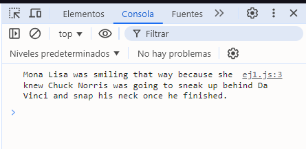
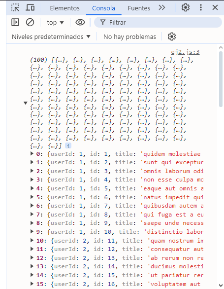
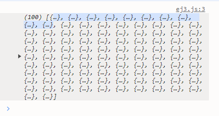
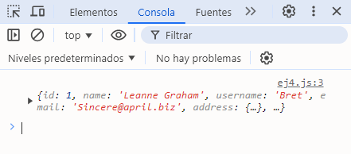
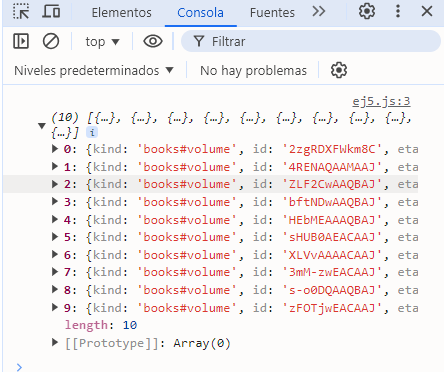
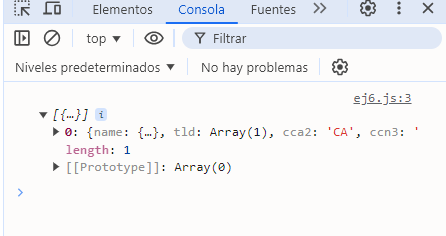
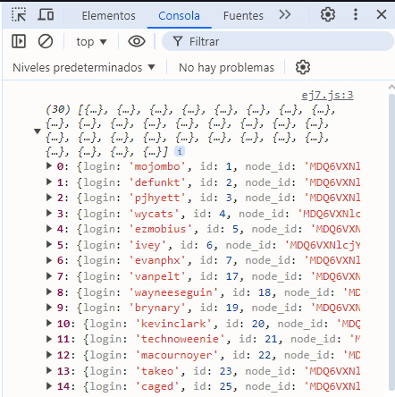
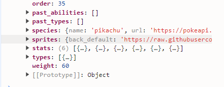

# Ejercicios con Get request

## 1. Obtener un chiste aleatorio
Realiza una solicitud a la API de chistes para obtener un chiste aleatorio.

### Solución

```javascript
fetch('https://api.chucknorris.io/jokes/random')
  .then(response => response.json())
  .then(data => console.log(data.value))
  .catch(error => console.error('Error:', error));
```

### Explicación:

- **API**: Se utiliza la API de Chuck Norris para obtener un chiste aleatorio.
- **`fetch`**: Realiza una solicitud GET a la URL especificada.
- **`response.json()`**: Convierte la respuesta en un objeto JSON.
- **`console.log(data.value)`**: Imprime el chiste en la consola.

### Resultado


## 2. Obtener una lista de álbumes
Realiza una solicitud para obtener un listado de álbumes.

### Solución
```javascript
fetch('https://jsonplaceholder.typicode.com/albums')
  .then(response => response.json())
  .then(data => console.log(data))
  .catch(error => console.error('Error:', error));
```
### Explicación:
- **API**: Se utiliza JSONPlaceholder para obtener una lista de álbumes.
- **`fetch`**: Realiza una solicitud GET a la URL de álbumes.
- **`response.json()`**: Convierte la respuesta en un objeto JSON.
- **`console.log(data)`**: Imprime la lista de álbumes en la consola.



## 3. Obtener una lista de posts

Solicita una lista de publicaciones desde una API pública de prueba.

### Solución

```javascript
fetch('https://jsonplaceholder.typicode.com/posts')
  .then(response => response.json())
  .then(data => console.log(data))
  .catch(error => console.error('Error:', error));
```

### Explicación:

- **API**: Se utiliza JSONPlaceholder, una API de prueba, para obtener una lista de publicaciones.
- **`fetch`**: Realiza una solicitud GET a la URL de publicaciones.
- **`response.json()`**: Convierte la respuesta en un objeto JSON.
- **`console.log(data)`**: Imprime la lista de publicaciones en la consola.

### Resultado


## 4. Obtener un usuario específico

Realiza una solicitud para obtener información de un usuario específico por su ID.

### Solución

```javascript
fetch('https://jsonplaceholder.typicode.com/users/1')
  .then(response => response.json())
  .then(data => console.log(data))
  .catch(error => console.error('Error:', error));
```
### Explicación:

- **API**: Al igual que el ejercicio anterior, se utiliza JSONPlaceholder para obtener datos de un usuario específico.
- **`/users/1`**: Especifica el ID del usuario que se desea obtener.
- **`response.json()`**: Convierte la respuesta en un objeto JSON.
- **`console.log(data)`**: Imprime la información del usuario en la consola.

### Resultado


## 5. Buscar un libro en la API de Google Books
Realiza una búsqueda de libros usando una palabra clave.

### Solución
```javascript
fetch('https://www.googleapis.com/books/v1/volumes?q=harry+potter')
  .then(response => response.json())
  .then(data => console.log(data.items))
  .catch(error => console.error('Error:', error));
```
### Explicación:

- **API**: Se hace una búsqueda en la API de Google Books usando una palabra clave.
- **`q=harry+potter`**: Especifica la consulta de búsqueda.
- **`response.json()`**: Convierte la respuesta en un objeto JSON.
- **`console.log(data.items)`**: Imprime la lista de libros encontrados en la consola.
### Resultado


## 6. Obtener datos de un país
Solicita datos de un país específico desde una API pública.

### Solución
```javascript
fetch('https://restcountries.com/v3.1/name/canada')
  .then(response => response.json())
  .then(data => console.log(data))
  .catch(error => console.error('Error:', error));
```
### Explicación:

- **API**: Se utiliza una API pública para obtener datos sobre un país específico (en este caso, Canadá).
- **`fetch`**: Realiza una solicitud GET a la URL correspondiente al país.
- **`response.json()`**: Convierte la respuesta en un objeto JSON.
- **`console.log(data)`**: Imprime los datos del país en la consola.
### Resultado


## 7. Obtener la cantidad de usuarios de GitHub
Haz una solicitud para obtener información sobre los usuarios de GitHub.

### Solución

```javascript
fetch('https://api.github.com/users')
  .then(response => response.json())
  .then(data => console.log(data))
  .catch(error => console.error('Error:', error));
```
### Explicación:

- **API**: Se hace una solicitud a la API de GitHub para obtener información sobre los usuarios.
- **`fetch`**: Realiza una solicitud GET a la URL de usuarios de GitHub.
- **`response.json()`**: Convierte la respuesta en un objeto JSON.
- **`console.log(data)`**: Imprime la lista de usuarios en la consola.
### Resultado



## 8. Obtener información de Pokémon
Haz una solicitud para obtener datos de un Pokémon específico.

### Solución
```javascript
fetch('https://pokeapi.co/api/v2/pokemon/pikachu')
  .then(response => response.json())
  .then(data => console.log(data))
  .catch(error => console.error('Error:', error));
```

### Explicación:

- **API**: Se utiliza la API de Pokémon para obtener datos sobre un Pokémon específico (en este caso, Pikachu).
- **`fetch`**: Realiza una solicitud GET a la URL del Pokémon.
- **`response.json()`**: Convierte la respuesta en un objeto JSON.
- **`console.log(data)`**: Imprime la información del Pokémon en la consola.
### Resultado
